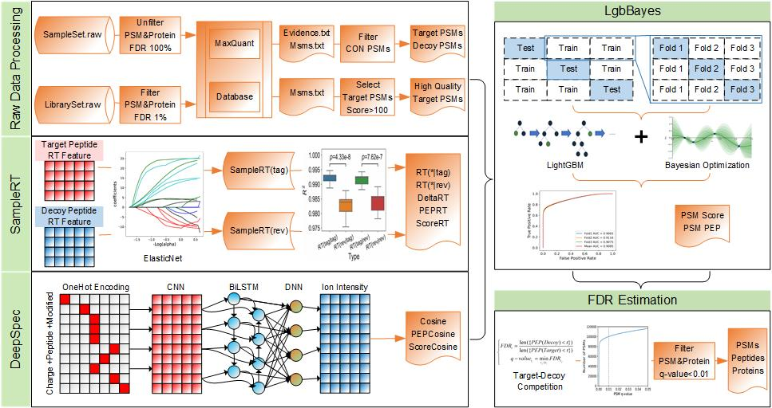

# DeepSCP

## Title

DeepSCP: utilizing deep learning to boost single-cell proteome coverage


## Abstract

Multiplexed single-cell proteomes (SCPs) quantification by mass spectrometry greatly improves the SCP coverage. However, it still suffers from a low number of protein identifications and there is much room to boost proteins identification by computational methods. In this study, we present a novel framework DeepSCP, utilizing deep learning to boost SCP coverage. DeepSCP constructs a series of features of peptide-spectrum matches (PSMs) by predicting the retention time (RT) based on the multiple SCP sample sets and fragment ion intensities based on deep learning, and predicts PSM labels with an optimized-ensemble learning model. Evaluation of DeepSCP on public and in-house SCP datasets showed superior performances compared with other state-of-the-art methods. DeepSCP identified more confident peptides and proteins by controlling q-value at 0.01 using target-decoy competition method. As a convenient and low-cost computing framework, DeepSCP will help boost single-cell proteome identification and facilitate the future development and application of single-cell proteomics.


 ## Kewwords

single-cell proteomics; peptide-spectrum matches; retention time; fragment ion intensity; deep learning; LightGBM


## Workflow

The architecture of DeepSCP has five steps. Firstly, for raw data processing, the information of target and decoy PSMs is extracted from MaxQuant search results of SCP sample sets, and the information of high quality target PSMs from MaxQuant search results of library sets. Secondly, SampleRT model predicts RTs using statistical features of peptide RTs in multiple SCP sample sets and ElasticNet, and generates features discriminating target and decoy PSMs. Thirdly, DeepSpec model uses the library sets to build a deep learning model to predict fragment ion intensities and produces features discriminating target and decoy PSMs of SCP sample sets. Subsequently, LgbBayes model predicts PSM label of SCP sample sets based on light gradient boosting machine (LightGBM)  with Bayesian parameter optimization using features from MaxQuant, SampleRT and DeepSpec. At last, FDR estimation is performed by using target-decoy competition at both PSM and protein levels to identify confident PSMs, peptides and proteins.




## Require

In DeepSCP, all the raw data were analyzed by software MaxQuant with N-terminal protein acetylation and methionine oxidation as variable modifications, and cysteine carbamidomethylation as a fixed modification. As shown in workflow, we set FDR to 1 at both PSM and protein levels to obtain more PSMs in the sample sets (than 2 SCP sample sets) and 0.01 to obtain high quality PSMs in the bulk or SCP library sets, and default settings were used for the other parameters.


## Install dependencies

```python
numpy
pandas
scipy
lightgbm
networkx
matplotlib
copy
time
joblib
bayes_opt
triqler
sklean
torch
argparse
warnings
```


## DeepSCP help

```pyhton
$ python DeepSCP.py -h
usage: DeepSCP.py [-h] [-e E] [-m M] [-lbm LBM]

DeepSCP: utilizing deep learning to boost single-cell proteome coverage

optional arguments:
  -h, --help            show this help message and exit
  -e E, --evidence E    SCP SampleSet, evidence.txt, which recorde information
                        about the identified peptides by MaxQuant with setting
                        FDR to 1 at both PSM and protein levels
  -m M, --msms M        SCP SampleSet, msms.txt, which recorde fragment ion
                        information about the identified peptides by MaxQuant
                        with setting FDR to 1 at both PSM and protein levels
  -lbm LBM, --lbmsms LBM
                        LibrarySet, msms.txt, which recorde fragment ion
                        information about the identified peptides by MaxQuant
                        with setting FDR to 0.01 at both PSM and protein
                        levels

```

## DeepSCP example

- Command mode

```python
$ python DeepSCP.py -e evidence.txt -m msms.txt -lbm lbmsms.txt
```

- Step by step

  example/demo/DeepSCP_example_(N2 dataset).ipynb

## References

Bing Wang, Yue Wang, Yu Chen, Mengmeng Gao, Jie Ren, Yueshuai Guo, Chenghao Situ, Yaling Qi, Hui Zhu, Yan Li, Xuejiang Guo, DeepSCP: utilizing deep learning to boost single-cell proteome coverage, *Briefings in Bioinformatics*, 2022;, bbac214, https://doi.org/10.1093/bib/bbac214

